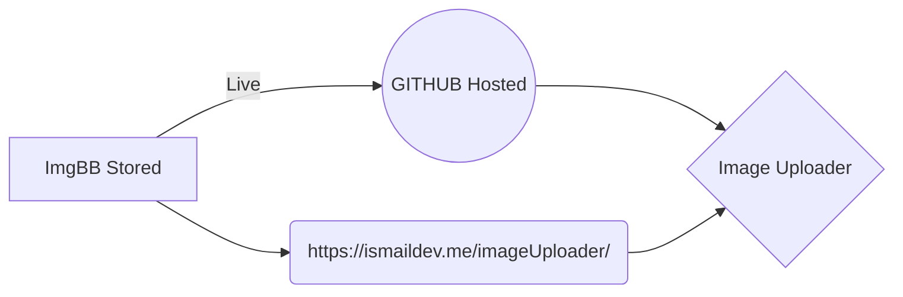

# Welcome to Image Up loader

image upload is a sort version of imgbb. it stored image on imgbb but we provide direct shareable link on after you upload . by default it **No-deleted**

**Using Technologies**
- React  (create-react-app)
- ImgBB API
- react-copy-to-clipboard

## Step  -1 Rename a file(optional)

First rename your **jpg,png or gif** image must be under 32 MB
this step is option recommended for sort url

## Step-2 Select a file

Click on **choose file** after open you local computer file window  **select your file** and click **Select**
then  Click **Copy Link**.

## Save a file on
You can save any file of the local storage to **Online**, **ImgBB** And **Direct link** by opening the **https://ismaildev.me/imageUploader/**

overview

